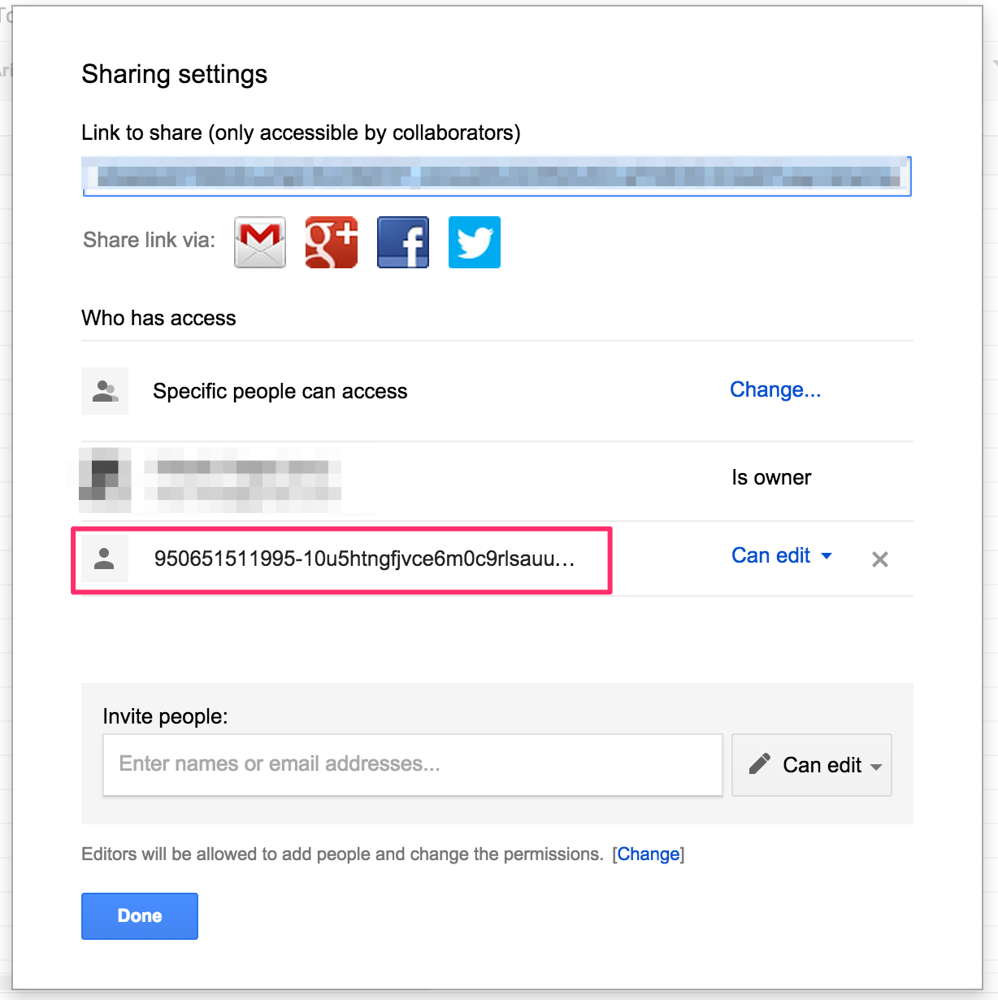

# GoogleSpreadSheetの自動編集その１

Google Driveで編集しているSpreadSheetを外部から編集し、自動的にレポートを書き込むことを目標にします。

ブラウザアプリケーションでなく、コマンドラインからの実行を目指すためOAuth2認証を省き、プログラム一発で認証が通るようにします。

## 環境

### マシン環境
- Java1.8
- Eclipse Luna
- Mac OSX Mervericks

### 必要ライブラリ
- Google data API 1.47.1(gdata)
- Google API client java 1.80.0 (最新は2.0)
- guava-r07.jar
- jaf-1.1.1/activation.jar
- java_mail/javax.mail.jar

## 準備

### 各種ライブラリのダウンロードと環境設定
上記のライブラリは必ずしも最新でなく、最新バージョンだと以下に出すサンプルコードでは動作しません。特にGoogle API clientの2.0が下位バージョン互換を完全無視なので注意。

OSやビルド環境はお好きにどうぞ。

### Google Service Account

いままでユーザー名とパスワードをコード内に埋め込んで動作することができましたが、ちょっと前からOAuth2認証が必須となりました。

しかしOAuth認証はユーザー操作がほぼ必須なので、コマンドラインアプリケーションとしては向きません。

今回は、サーバーtoサーバーの認証を行うために、Service Accountを作成します。

#### Google Developer Console
[Google Developer Console](https://console.developers.google.com/project?authuser=0)

プロジェクトのオーナー権限を持つユーザーでログインします。このユーザーでしかサービスアカウントを作成できません。

##### APIと認証->認証情報
クライアントIDを作成します。

新しいアカウントIDを作成を押下します。

アプリケーションの種類を**サービスアカウント**とし、キータイプを**p12キー**とします。

作成されるとp12ファイルが自動的にダウンロードされ、画面上に作成したサービスアカウントが表示されます。
このp12ファイルは無くさないようにします。

プログラム上で必要な情報は**メールアドレス**情報と、この**p12ファイル**です。

## Eclipse環境設定

プロジェクトを作成し、必要なライブラリを読み込みます。
分かる人は飛ばしてどうぞ。

### プロジェクト作成

プロジェクトを作成します。

### ライブラリの追加

作成したプロジェクトを右クリック→Properties

Java Build PathのLibrariesを選択し、Add External JARs
すでにダウンロードしてあるjarファイル群を追加していきます。

#### Google Data API

libs以下のjarファイル全て(Ctrl+A)を選択しインポート

#### Google API client java 1.80.0

libs以下のjarファイル全て(Ctrl+A)を選択しインポート

#### guava-r07.jar

#### jaf-1.1.1/activation.jar

#### java_mai/javax.mail.jar

---

全部入りました。

### ソースコード作成

main関数を用意します。

パッケージ名は適当に作成し、

mainを実行するクラスを作成します。

~~~java
package com.gclue.main;

public class GoogleSpreadSheetAPISample {

	public static void main(String[] args) {
		// TODO Auto-generated method stub

	}
	
}
~~~

### p12ファイルのコピー

先ほどダウンロードされたp12キーファイルを、プロジェクトディレクトリ直下に配置します。
自動でダウンロードされたファイル名はちょっと長いので、適当にリネームします。

プロジェクトの更新をして、p12ファイルがプロジェクト直下に登録されていることを確認します。

## Google Drive上にシートを作成

Google DriveまたはGoogle Sheetsでスプレッドシートを作成します。アカウントは、Google Developer Consoleにアクセスできるアカウントでもなんでも良いです。

どんな方法でもよいので、スプレッドシートを作成します。

ワークシートのタイトルを編集し、ついでにシート名も編集します。

## Google Credential

Google APIを使用するために必要な認証周りを行います。

必要な情報は、

- サービスアカウントのp12キー
- サービスアカウントのメールアドレス
- どのサービスを使用するかを記述するスコープ

以上です。

### コード

~~~java
	private static final String ServiceAccountMailAddress = "";
	
	static GoogleCredential getCredential() {
		File p12 = new File("./key.p12");

		HttpTransport httpTransport = new NetHttpTransport();
		JacksonFactory jsonFactory = new JacksonFactory();
		String[] SCOPESArray = { "https://spreadsheets.google.com/feeds" };
		final List<String> SCOPES = Arrays.asList(SCOPESArray);
		GoogleCredential credential = null;
		try {
			credential = new GoogleCredential.Builder()
					.setTransport(httpTransport)
					.setJsonFactory(jsonFactory)
					.setServiceAccountScopes(SCOPES)
					.setServiceAccountPrivateKeyFromP12File(p12)
					.setServiceAccountId(ServiceAccountMailAddress).build();
		} catch (GeneralSecurityException e) {
			e.printStackTrace();
		} catch (IOException e) {
			e.printStackTrace();
		}

		return credential;
	}
~~~

ここで指定するServiceAccountMaiAddressのパラメータは、ログインを行うメールアドレスではなく、Google Developer Console上に表示されている、サービスアカウントのメールアドレスです。

~~~java
String[] SCOPESArray = { "https://spreadsheets.google.com/feeds" };
~~~

Google Spreadsheetを使うためのスコープURLは上記になります。他のサービスを使う場合は、この配列にスコープを追加していきます。今回は、Spreadsheetだけです。

## SpreadsheetService

Google SpreadSheetを使うためのサービスクラスです。ここに先ほど作成した認証情報を登録することで、サービスを使用することができます。

### コード

~~~java
	static String ApplicationName = "";
	static SpreadsheetService spreadsheetService = null;
	
	static synchronized SpreadsheetService getSpreadsheetService(GoogleCredential credential) {
		if(spreadsheetService == null) {
			spreadsheetService = new SpreadsheetService(ApplicationName);
		}
		spreadsheetService.setOAuth2Credentials(credential);
		
		return  spreadsheetService;
	}
~~~

ApplicationNameは任意で問題ありません。

サービスの取得をsingletonにしていますが、特にこだわりはないので好きにしてよいです。

~~~java
spreadsheetService.setOAuth2Credentials(credential);
~~~

この箇所だけしっかりと設定するようにします。

## GoogleSpreadSheetの取得

サービスの取得までできたので、実際にシートを取得してみます。

### Feed取得とEntryリストの取得

~~~java
static List<SpreadsheetEntry> getSpreadsheets(SpreadsheetService service) throws IOException, ServiceException {
		URL spreadSheetFeedURL = new URL(
				"https://spreadsheets.google.com/feeds/spreadsheets/private/full");
		SpreadsheetFeed feed = service.getFeed(spreadSheetFeedURL, SpreadsheetFeed.class);
		List<SpreadsheetEntry> spreadsheets = feed.getEntries();
		
		return spreadsheets;
	}
~~~

サービスからスプレッドシートのフィードを取得します。

Google data APIではこのフィードをベースにデータの取得を行い、実データとしてエントリーを取得します。

~~~java
URL spreadSheetFeedURL = new URL(
				"https://spreadsheets.google.com/feeds/spreadsheets/private/full");
~~~

ここで指定したURLはスプレッドシートの内、プライベートなシートに対してフルアクセスを要求しています。
privateをpublicに変更すれば、publicなシートのみになりますし、fullをbasicに変えることで、アクセス権限が変更されます。

特に変える必要がなければこのURLで問題無いです。
また、

~~~java
URL url = FeedURLFactory.getDefault().getSpreadsheetsFeedUrl();
~~~
こちらを使用しても、同様の結果が得られます。

~~~java
List<SpreadsheetEntry> spreadsheets = feed.getEntries();
~~~

feedからエントリーを取得します。フィードには複数のスプレッドシートが含まれる（可能性がある）ので、リストで取得されます。

SperadsheetEntryがスプレッドシートのワークシートです。

### main関数

~~~java
	public static void main(String[] args) {
		// 認証情報の取得.
		GoogleCredential credential = getCredential();
		// スプレッドシートサービスを認証情報を使用して取得.
		SpreadsheetService service = getSpreadsheetService(credential);
		
		List<SpreadsheetEntry> sheetEntries = null;
		try {
			sheetEntries = getSpreadsheets(service);
		} catch (IOException e) {
			e.printStackTrace();
		} catch (ServiceException e) {
			e.printStackTrace();
		}

		if(sheetEntries != null) {
			System.out.println("取得したシート数: " + sheetEntries.size());
			
			System.out.println("---");
			System.out.println("取得したシート一覧");
			for (SpreadsheetEntry sheetEntry : sheetEntries) {
				System.out.println(sheetEntry.getTitle().getPlainText());
			}
			System.out.println("---");
		}

	}
~~~

main関数を以上のように修正します。

try-catchはこちらにthrowするか、getSpreadsheets関数内で処理するかは好みです。

~~~java
        if(sheetEntries != null) {
            System.out.println("取得したシート数: " + sheetEntries.size());
            
            System.out.println("---");
            System.out.println("取得したシート一覧");
            for (SpreadsheetEntry sheetEntry : sheetEntries) {
                System.out.println(sheetEntry.getTitle().getPlainText());
            }
            System.out.println("---");
        }
~~~

実際に取得できたEntryのデータを確認するコードです。

準備ができたら実行を行います。
コマンドラインからでも良いですし、Eclipseであれば実行ボタンで動きます。

### 実行

ここでExceptionが発生する場合は、なにかしらが間違っています。

- ダウンロードするp12ファイルに間違いはないか
- プロジェクト内に正しくp12ファイルは配置されているか
- p12ファイルのパス指定は間違っていないか
- 指定するメールアドレスが間違っていないか
- ライブラリは正常にインポートしているか

エラーを見て正しく修正を行ってください。

正常に動作すれば以下のような出力結果が得られます。

~~~bash
取得したシート数: 0
---
取得したシート一覧
---
~~~

本当であれば、さきほど作成したシートが表示されても良さそうですが取得できません。

作成したシートへの設定が足りないようです。

### シートへ編集権限の追加
ここで半日くらい時間を無駄にしました。

先ほど作成したシートを開き、Shareを押下します。

ここに、DeveloperConsole上に表示されている(コード上に設定した）メールアドレスを追加します。

追加したメールアドレスが編集権限を持っていることを確認し、再度プログラムを実行します。

### 再度実行

~~~bash
取得したシート数: 1
---
取得したシート一覧
GoogleSheetAPISample
---
~~~

正常に取得出来ました。ここからはやりたい放題です。